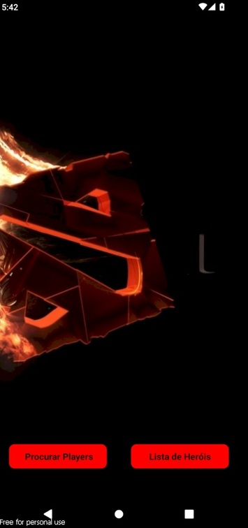
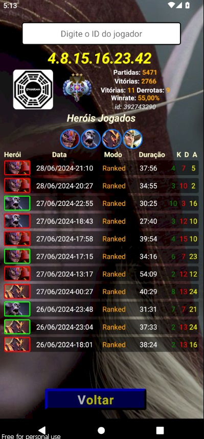
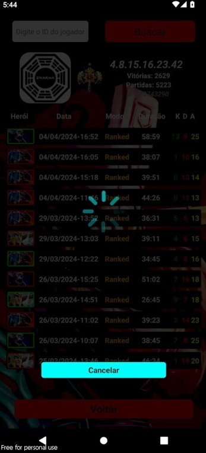
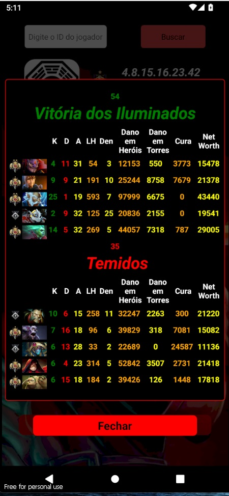
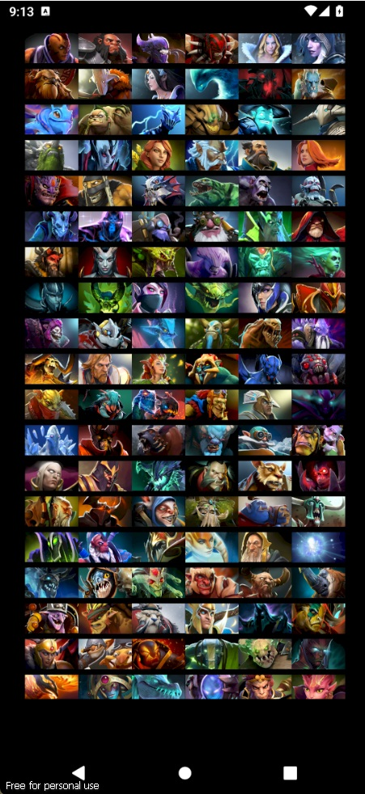
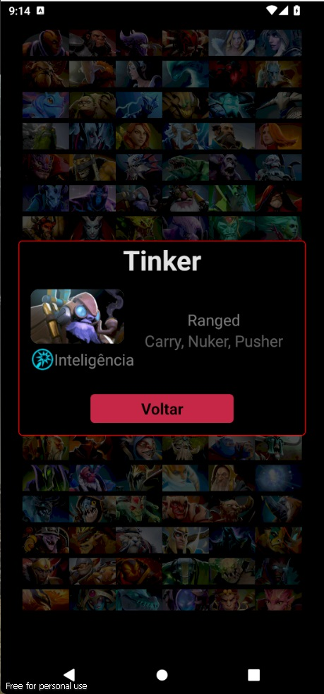

# 📱 API Dota 2

## ✨ Introdução✨ 

Bem-vindo à minha **API do Dota 2**! Este projeto foi criado para conseguir buscar dados de jogadores do Dota 2. Aqui está uma visão geral do que você encontrará:

## 🚀 Funcionalidades

- Listar amigos
- Ver últimas 20 partidas
- Lista dos Heróis

## Tecnologias Utilizadas**:
  - 🚀 TypeScript
  - ⚛️ React Native

  📸 Screenshots
<!--  -->
<!--  -->

