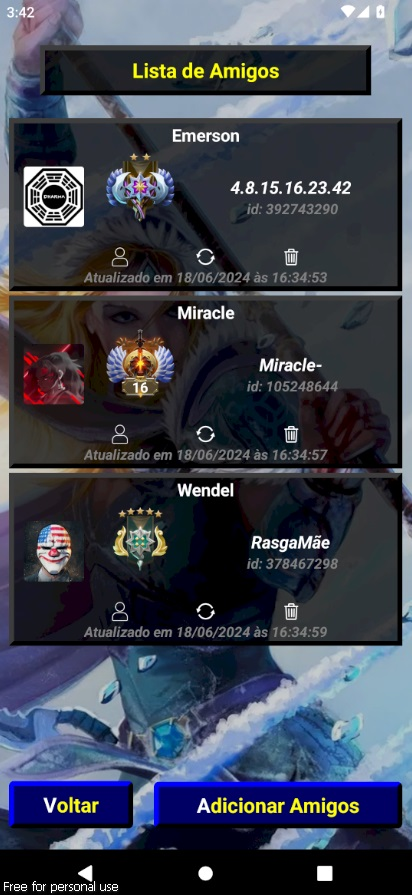

# 📱 API Dota 2

## ✨ Introdução✨ 

Bem-vindo à minha **API do Dota 2**! Este projeto foi criado para conseguir buscar dados de jogadores do Dota 2. Aqui está uma visão geral do que você encontrará:

## 🚀 Funcionalidades

- Listar amigos;
- Consultar os perfils dos amigos a partir da lista;
- Ver últimas 20 partidas;
- Ver os dados dos jogadores da sua partidas como kills, mortes, danos causados e networth;
- Lista dos Heróis;

## ⚙️ Tecnologias Utilizadas:
    - ⚛️ React Native;
    - ⚛️ Expo;
    - 🚀 TypeScript;

  📸 Screenshots

 | 
|:---:|:---:|
 | 
|:---:|:---:|
 | 

