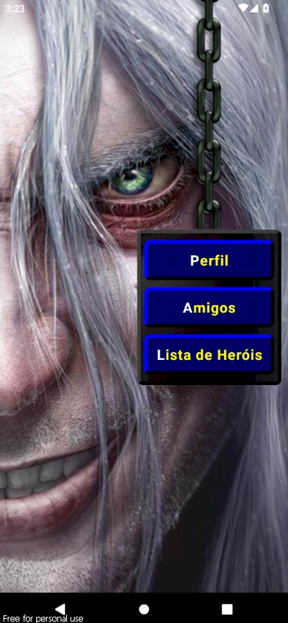
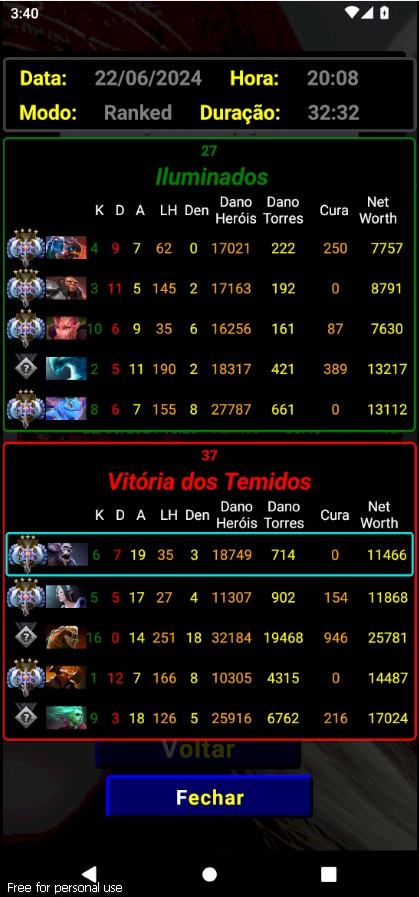
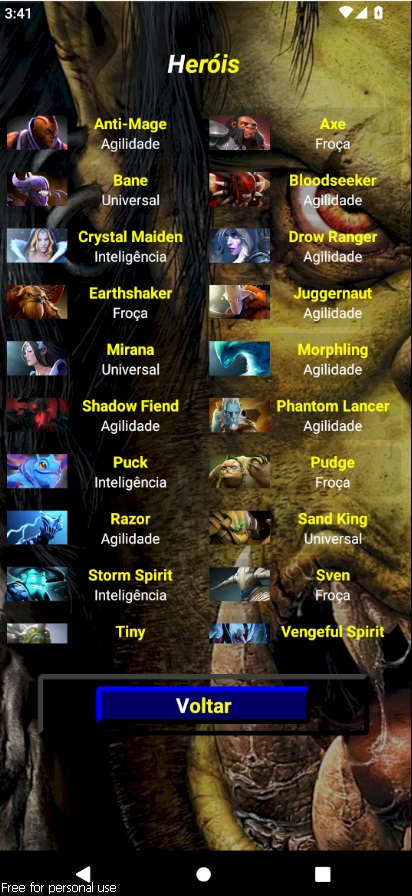

# 📱 API Dota 2

## ✨ Introdução✨ 

Bem-vindo à minha **API do Dota 2**! Este projeto foi criado para conseguir buscar dados de jogadores do Dota 2. Aqui está uma visão geral do que você encontrará:

## 🚀 Funcionalidades

- Listar amigos;
- Consultar os perfils dos amigos a partir da lista;
- Ver últimas 20 partidas;
- Ver os dados dos jogadores da sua partidas como kills, mortes, danos causados e networth;
- Lista dos Heróis;

## ⚙️ Tecnologias Utilizadas:
    - ⚛️ React Native;
    - ⚛️ Expo;
    - 🚀 TypeScript;

 ## Instalação

### Android

1. Faça o download do APK mais recente do [Aplicativo](https://github.com/Emerson2342/dota2/releases/).
2. Instale o APK no seu dispositivo Android.

### iOS

Atualmente não suportado.

## Como Usar

- **Configuração Inicial:**
  - Na primeira vez ao buscar jogador por ID é necessário o id ter 9 dígitos, caso o id tenha apenas 8, adicionar o 0 no começo. O mesmo vale apra adicionar amigos.
  - Ao adicionar um amigo é necessário atualizar, para ir no perfil do amigo, basta clicar no ícone profile que será redirecionado para o perfil do amigo selecionado.

  ## 📸 Screenshots

 | 
|:---:|:---:|

 | 
|:---:|:---:|

 | 
|:---:|:---:|

  ## Licença

-**Suporte**
    Para suporte ou feedback, entre em contato via WhatsApp: +55 (61) 99835-4398 (https://wa.me/5561998354398) ou pelo email: lyncoln_erc@hotmail.com

---
2024 | Desenvolvido por Emerson Ribeiro

